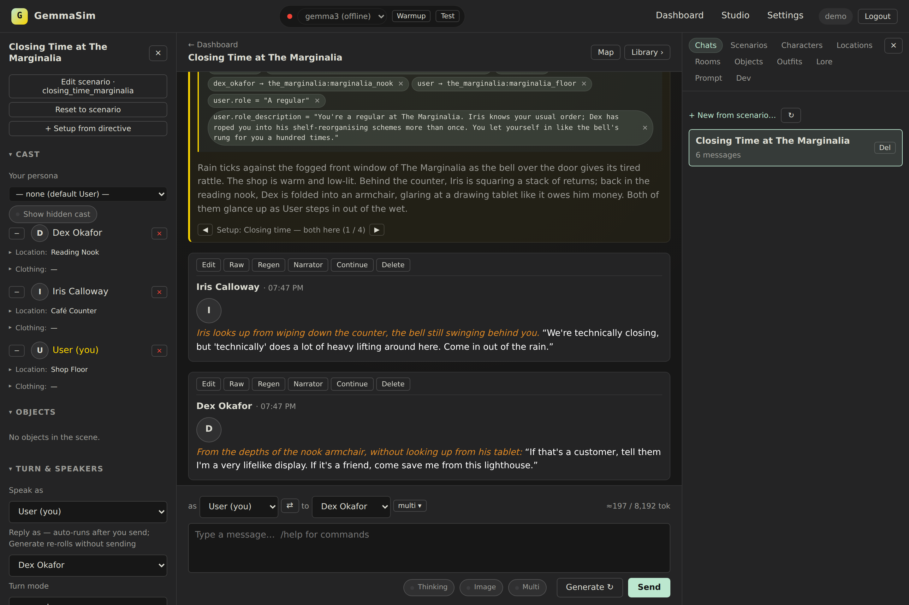
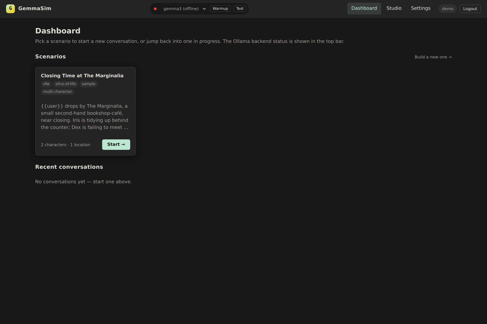
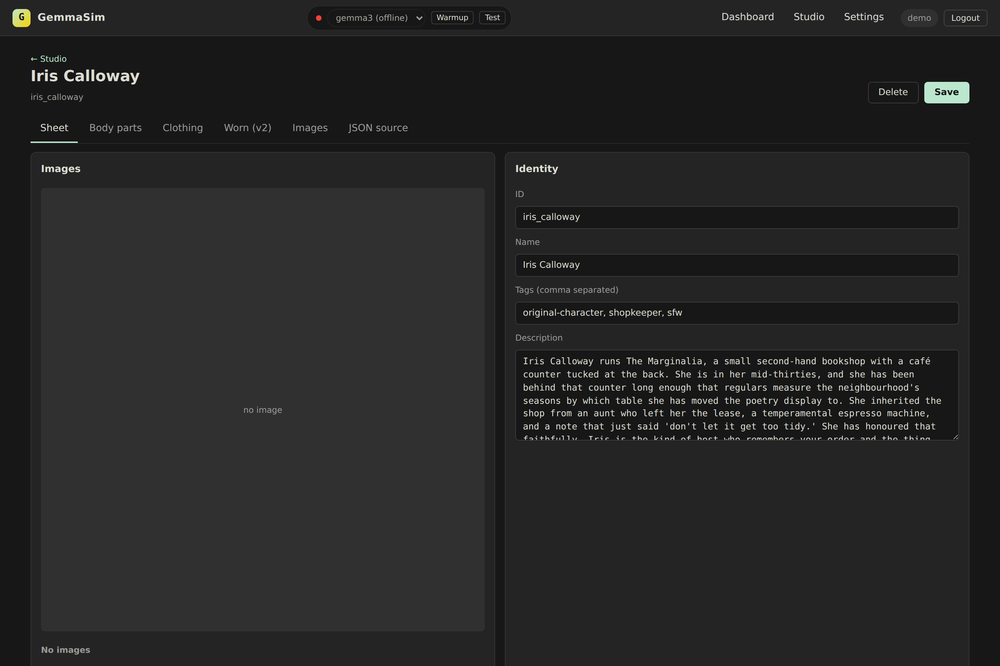

# GemmaSim

A self-hosted, local-first **narrative roleplay engine** — a from-scratch alternative to chat front-ends like SillyTavern, built around a local LLM served by [Ollama](https://ollama.com) (Gemma by default, hence the name).

Instead of treating a character as a single blob of prompt text, GemmaSim models a small **world**: characters, locations and rooms, scenarios, wardrobe and state, and a **narrator** that stages scenes and tracks what has changed. Each turn's prompt is *composed* from that world state through a layered pipeline, so characters stay consistent, remember where they are, and react to what's actually happening around them.

> **Status:** a personal project, shared as a portfolio piece. It runs, but it's a solo codebase, not a supported product. The sample content ships an original cast — no third-party characters or assets are included.

---

## Screenshots

**A staged, multi-character scene** — the narrator sets the scene, each character speaks for itself, and the left panel tracks where everyone is; the "Setup 1 / 4" navigator switches between branchable openings.



**The dashboard** (pick a scenario) and **the Studio** (author characters, locations, scenarios in the browser):

| Dashboard | Studio — character editor |
| --- | --- |
|  |  |

---

## What it does

- **Local and private.** Everything runs on your own machine against Ollama. No API keys, no cloud calls, nothing leaves the box.
- **Structured world model.** Characters, locations, rooms, scenarios, outfits and states are plain JSON entities loaded from `data/`. Scenarios wire characters into a place with a starting state and an opening beat.
- **Composed prompts, not static cards.** A prompt registry assembles each turn from the live world — who's present, where they are, what they're wearing, what's changed — via an "effective state" resolver that layers overrides on top of base definitions.
- **A narrator persona.** Beyond the characters themselves, a narrator stages scenes, moves characters between rooms, and applies changes to the world through a small directive grammar (`[move ...]`, `[outfit ...]`, `[state ...]`, `[set ...]`).
- **Multi-character scenes.** Several characters plus the narrator can share a scene and take turns.
- **A web UI + authoring Studio.** A Flask app serves a chat interface and a "Studio" for authoring characters, locations, rooms, scenarios, outfits and objects in the browser.
- **A module plugin system.** Drop-in modules under `data/modules/<id>/` register prompt blocks, filters, GUI controls and routes at startup — a failing module logs a warning instead of taking down the engine. Two clean example modules ship: **Texting** (a prompt filter for off-scene text-message exchanges) and **Locked Image** (a pinned character-image frame).
- **Optional sprite composition.** Characters *can* declare layered sprite packs that the app composes into per-scene PNGs — but this is entirely optional, and characters run text-only with no image assets at all (the bundled samples do).
- **Extensible character format.** A structured character format with prose `appearance` / `emotional_map` fields and a hard `boundaries` guardrail that constrains how each character may be portrayed.

---

## Architecture at a glance

```
run.py                    # entry point → app.create_app()
app/
  __init__.py             # Flask app factory: config, sessions, IP allowlist,
                          # blueprint + module + prefab loading
  config.py               # config.example.json  <-  config.local.json overrides
  entities.py             # load/validate the world: characters, locations,
                          # rooms, scenarios, outfits, states, ...
  storage.py              # JSON read/write, recursive data/ loader
  effective.py / layers.py / merge.py
                          # "effective state" — resolve a character's live
                          # description by layering overrides over the base
  prompt/                 # prompt registry + composition pipeline (core.py)
  personas.py             # character + narrator prompt cards
  narrator*.py            # narrator: add / edit / apply world changes
  conversations.py        # conversation + branch/checkpoint model
  multi_response.py       # multi-character turn handling
  clothing_v2.py          # slot-based wardrobe state
  ollama_client.py        # streaming chat against Ollama
  modules/                # generic module (plugin) loader
  prefabs/                # generic "prefab" staging-kind loader
  routes/                 # Flask blueprints: pages, api, stream, sprites, ...
  templates/ static/      # web UI + Studio, CSS/JS
data/                     # the world, as JSON (see below)
docs/ARCHITECTURE.md      # a deeper tour of the pipeline
```

### The data model

```
data/
  characters/<id>/<id>.json     # a character
  locations/<id>/<id>.json      # a place, with...
  locations/<id>/rooms/*.json   # ...its rooms
  scenarios/<id>.json           # characters + a place + starting state + opening
  states/*.json                 # reusable affect overlays ([state <char> -> nervous])
  modules/<id>/                 # drop-in feature modules
```

Everything is loaded by a single recursive scan of `data/`; an entity is placed by its `type` field, not its folder, so the layout is a convention for humans. Missing subdirectories are harmless.

---

## Quick start

**Prerequisites:** Python 3.10+ and [Ollama](https://ollama.com) running locally with a model pulled:

```bash
ollama pull gemma3      # or any chat model; set the name in config
```

**Run it:**

```bash
# macOS / Linux — creates a venv, installs deps, starts the server
./start.sh

# ...or manually
pip install -r requirements.txt
python run.py
```

On Windows, use `start.bat`.

Then open <http://127.0.0.1:5000>. Configuration is optional — the app runs out of the box on localhost with the defaults in `config.example.json`. To change the model, port, or network settings, copy your overrides into `config.local.json` (git-ignored); it deep-merges over the example.

### Try the sample scene

The repo ships one original, self-contained sample scenario:

- **Closing Time at The Marginalia** — a cozy second-hand bookshop-café near closing. **Iris Calloway** (the wry owner) is behind the counter; **Dex Okafor** (a regular illustrator dodging a deadline) is in the reading nook. Chat with either, move between rooms, or just browse. It's a small showcase of multi-character scenes, the narrator, and the room model.

---

## Configuration

`config.example.json` is the documented base; `config.local.json` (git-ignored) overrides it. Highlights:

- `ollama.host` / `ollama.model` — where Ollama lives and which model to use.
- `ollama.default_options` — temperature, context window, penalties.
- `network.allowed_ips` — an IP allowlist for exposing the app on a LAN (loopback is always allowed; empty list = open on localhost only).
- `defaults` — per-conversation defaults (narrator mode, context limit, optional second-pass features, a `style_discipline` banned-phrase filter).

Sensitive/runtime files are git-ignored: `config.local.json`, `data/users.json`, `flask_session/`, and anything under `data/private/`.

---

## Tests

A small `pytest` suite covers the pure logic that doesn't need a model running — entity loading and validation, the narrator directive grammar, scenario setups / scene-staging, deep-merge, and that the Flask app factory boots and gates its pages behind auth.

```bash
pip install -r requirements-dev.txt
pytest
```

CI runs the suite and a smoke-boot of the app on every push — see [`.github/workflows/ci.yml`](.github/workflows/ci.yml). (Once you've pushed to your own repo, you can add a status badge: ``.)

---
